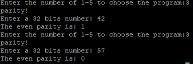
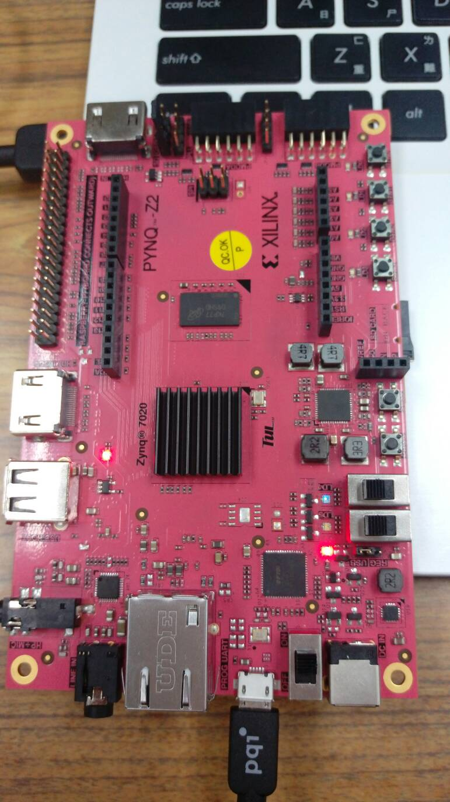
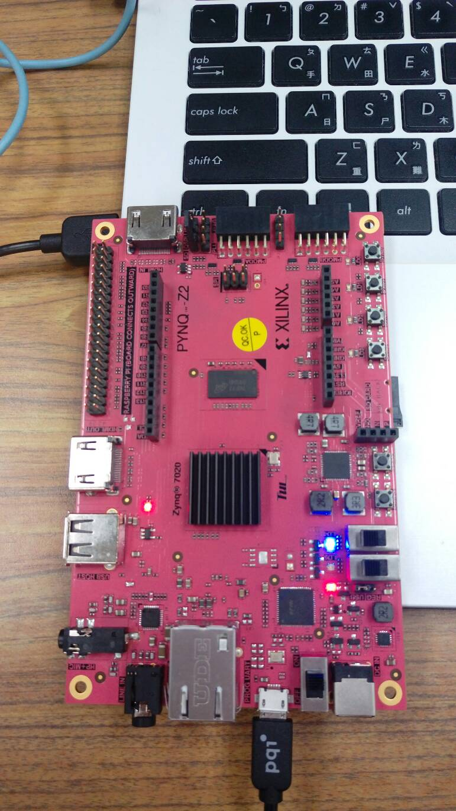

FPGA_Design Lab05 HW
====

# 成員名單
E24041810 E24046755 E24046307 

# block diagram

# Program 1.
### 設計一個排序電路，由 processor 輸入一串數字將其排序後傳回。(數列長度固定)
### 設計說明
1. 分別輸入4個4bits的數去做排序，出來結果為由小至大。
2. 

# Program 2
### 設計一個計算電路，由 processor 輸入運算子與運算元並回傳運算完的結果。(加, 減, 乘)
### 設計說明
1. 分別輸入2個3 bits的數字，還有一個符號(+或-或*)去做運算。

測試加法、減法(大減小、小減大)、乘法。

# Program 3
### 設計 parity generator，輸入 32-bit 資料回傳其 parity bit (禁止額外暫存器的使用 ex: counter)。
### 設計說明
1. 直接將32 bits資料的每一bit相加，再做除以2取餘數的動作，
   以even parity而言，若取餘數後等於1則結果為1；若取餘數後等於0則結果為0。

# Program 4
### 設計 djb2 這個 hash function 的電路。
### 設計說明
1. 輸入一串長度為4 bytes的字串，並經由ASCII表轉換為32 bits的資料，並去做hash function。

# Program 5
### 設計 PWM controller。
### 設計說明
1. 輸入一個8 bits的數字，去決定PWM的時間。
2. 利用switch去選擇要哪個顏色，01為紅色；10為綠色；11為藍色。
3. 這邊測試藍色，可發現pwm=1時很暗；pwm=100時則亮度明顯增加。

  pwm=1

  pwm=100

