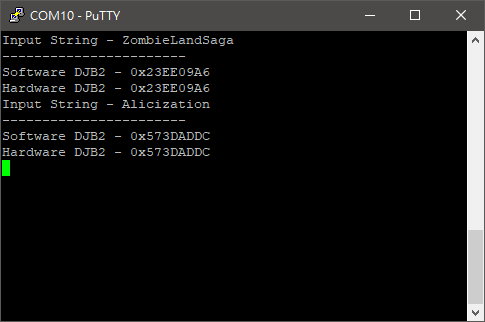

FPGA-based System Design - Lab05 HW
=

* [Member](#Member)
* [Program1](#Program1)
* [Program2](#Program2)
* [Program3](#Program3)
* [Program4](#Program4)
* [Program5](#Program5)

<h2 id="Member">Member</h2>

- E24056572   
- E24056637   
- E24054203   

<h2 id="Program1">Program1 設計排序電路</h2>  

<h2 id = "Program2">Program2 設計計算電路</h2>

<h3>Introduction</h3>

電路會從axi的slave register讀取兩個16位元數，經過運算與擴充後寫回一個32位元數，由cpu輸入的部分會是兩個帶符號的short以及一個運算模式的訊號。  

Deiver的部分惠要求使用者輸入四個參數，分別是base address、兩個帶符號短整數以及一個運算子，運算子的部分支援+、-以及*三種字元。

在driver程式碼的部分要注意的是不同資料型態的資料處理，由於實作上我將兩個16位元數串成一個32位元數寫入axi slave register，因此需要將傳給driver的兩個短整數其中一個左移16位後與另外一個短整數做OR運算，左移16位的結果會受到短整數是正值還是負值影響，因此儘管輸入的是帶符號數，在driver之中依然使用u16、u32這兩個型態來處理。  

而因為本電路並沒有使用到clock，因此timing constraint裡面只有使用virtual clock。

<h3>Result</h3>

<h2 id="Program3">Program3 設計parity generator</h2>  

<h3>Introduction</h3>

 此處我們使用的是even_parity_bit_generator。
 even_parity_bit 與 data 的 bit 1 個數有關，
 只需要將 data 全部 bit 進行 XOR 運算，即可得 even_parity_bit。
 
 在 verilog 有對全部 bit 運算的指令，
 稱為 Reduction Operator。
 除了 XOR ，還有以下5個 Reduction Operator：
 AND OR NAND NOR XNOR

 even_parity_bit 即由 Reduction XOR 計算而得
 如下：
    even_parity_bit =  (^data);

<h3>Result</h3>

<h2 id="Program4">Program4 設計dib2 hash function電路</h2>  

### Introduction

本項作業要求我們實作DJB2的電路，本Hashing Function是由Dan Bernstein所提出的，從初始hash值為5381開始，將hash乘上33加上目前的字元得到新的hash值。

而為什麼是選擇33，至今沒有獲得太多解釋。這裡比較在意的是[原連結](http://www.cse.yorku.ca/~oz/hash.html)所指的`unsigned long`到底是多長，因為long基本上其實是一個型態大小各自表述[1](https://en.wikipedia.org/wiki/64-bit_computing#64-bit_data_models)，網路上找了許多的資料都表明DJB2會給出32bit的hash值，因此本次作業我們同樣是輸出32bit的hash值。

### Programming

本次我們採用32bit\*4條的AXI4 Bus作為IO，主要的hash電路由以下FSM構成，一次可以處理1~4個字元。(L代表資料數量，此處省略了Reset)

電路會接收一個32bit的指令，其中包含了4bit的指令欄位以及28bit的資料欄位，並且輸出32bit的hash值，以及1bit代表busy的訊號：

|31   |30    |29~28      |27~21 |20~14 |13~7  |6~0   |
|:---:|:----:|:---------:|:----:|:----:|:----:|:----:|
|Reset|Enable|Data Length|Data 4|Data 3|Data 2|Data 1|

當Reset為1時，不管後面指令為何，電路行為必定為Reset，即是將hash值設回初始值5381，並且state回到IDLE。

而Enable採正緣觸發，只要收到一次正緣Enable，電路就會根據後面的資料長度以及資料做一次hash運算，此時電路會將busy拉高，代表電路忙碌中：
- Data Length = 00，代表有一筆資料，會取出Data 1進行一次運算。
- Data Length = 01，代表有兩筆資料，會取出Data 1,2進行兩次運算。
- Data Length = 10，代表有三筆資料，會取出Data 1,2,3進行三次運算。
- Data Length = 11，代表有四筆資料，會取出Data 1,2,3,4進行四次運算。

做完一次運算後，電路將busy拉回0，此時便可從輸出端取出hash值，等待下一次運算。不過本電路目前有一個缺點是在電路運算途中，需保持Data與Data Length欄位值不變才可正常運作。

關於Enable正緣觸發的技巧：多使用了1個暫存器En_delay，將En_delay的D接上Enable，並且將Enable與~En_delay做AND運算，即可獲得只有一個clock的EN訊號；將這個訊號接上內部運算電路即可構成正緣觸發。

而Driver的實作，使用者只要提供一串字串以及其長度，Driver就會將字串切成4個為一組送進電路裡，拉高後拉低Enable訊號並等待電路Busy訊號變為0，再送入下一筆資料繼續運算，等待全部運算結束之後，再自輸出暫存器取出hash值即可。

### Result

### Note

本次還有一個小疑問，原本我們是將我們自己寫的電路的clk直接接上S_AXI_ACLK，可是在做ooc的時候，ooc無法`get_ports clk`也無法`get_ports S_AXI_ACLK`，都顯示找不到。最後我們暫時先將clk拉出去外面，外面再直接拉線接上AXI的CLK解決這個問題，不知道這個解法是不是正確的，或者是有其他的解決方法。

<h2 id = "Program5">Program5 設計pwm控制電路</h2>

<h3>Introduction</h3>

作業要求為設計PWM Controller，我們延續在Lab2使用過的設計，而為了使用上更方便且更有彈性，我們將pwm的輸出port增加到四個，四個都可以獨立運作，輸出的PWM duty cycle則參考了Arduino上使用的設計，範圍從0至255。  
Driver目前提供了pwm_out這個function，這個函式會要求佔存器的Base Adderess、Port以及輸出數值，由於提供了四個port，port的範圍為0至3，超過則不會有任何動作。

<h3>Programming</h3>

實作上，pwm控制器會從一個slave register讀取使用者要求的0至255間的資料，我們將四個port共32bit的資料存放在一個佔存器之中，當使用者輸入某一個port以及8位元資料時，Driver會根據輸入的port，將本來的32位元資料中對應port的8位元資料替代掉，接著寫入佔存器中讓Controller讀取。  

<h3>Result</h3>  
以下是demo影片。  

<a href = "https://youtu.be/gYdYgQHwCoA">PWM_Controller Example</a>

